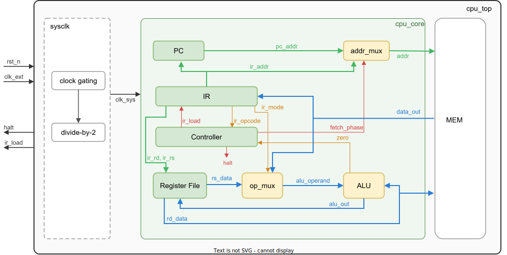
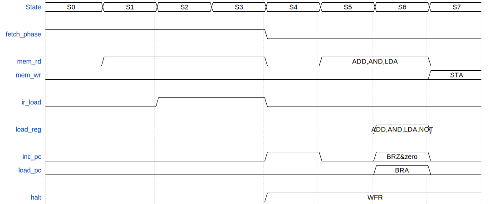

<!-- _class: title -->
<!-- _header: "" -->
<!-- _footer: "" -->
<!-- _paginate: false -->

# MicroCPU 설계 실무

Class 02: MicroCPU 블럭 스펙

      
건양대학교 국방반도체공학과 백종섭 교수

---

## 학습 목표

- cpu_top의 외부 인터페이스(핀 스펙)를 이해한다
- 내부 블럭 구성과 데이터 경로를 파악한다
- 8-상태 FSM 기반 명령어 실행 흐름을 추적할 수 있다
- 각 블럭의 포트, 동작, 구현 코드를 분석할 수 있다
- Controller FSM의 opcode 디코딩과 제어 신호 생성을 이해한다

---

## 2.1 MicroCPU 핀 스펙

> cpu_top 모듈은 4개 핀만 외부에 노출하며, 내부의 모든 클럭과 데이터 경로는 외부에서 보이지 않는다

| Pin Name | Type | Width | Description |
| --- | --- | --- | --- |
| clk_ext | Input | 1 | System clock. Rising edge active. sysclk에서 2분주되어 내부 클럭(clk_sys)을 생성한다. |
| rst_n | Input | 1 | Active-low asynchronous reset. Low 입력 시 클럭과 무관하게 모든 내부 레지스터를 0으로 클리어하고, FSM을 초기 상태로 복귀시킨다. |
| halt | Output | 1 | Processor halt indicator. Active-high. WFR 명령어(opcode 000) 실행 시 high가 되며, 리셋 전까지 유지된다. halt=1이면 clock gating으로 내부 클럭이 정지한다. |
| ir_load | Output | 1 | Instruction fetch observation signal. Active-high. 매 fetch 단계에서 1사이클 동안 high가 된다. 실행된 명령어 수를 측정하거나 명령어 경계를 식별하는 데 사용한다. |

---

## 2.2 MicroCPU 블럭 다이어그램

> cpu_top 내부의 블럭 구성과 데이터 경로. sysclk, cpu_core, MEM 3개 블럭으로 나뉜다

---

## 2.3 MicroCPU 내부 신호

> 블럭 간 연결 신호의 이름, 폭, 방향을 정리한다

| Signal | Width | From | To | Description |
| --- | --- | --- | --- | --- |
| ir_opcode | 3 | IR | Controller | 디코딩된 opcode를 전달한다. |
| ir_mode | 1 | IR | op_mux | mode 비트로 Operand MUX의 입력을 선택한다. |
| ir_rd, ir_rs | 2, 2 | IR | Register File | 목적/소스 레지스터 주소를 전달한다. |
| ir_data | 8 | IR | addr_mux, PC | 피연산자 주소 또는 분기 주소를 전달한다. |
| pc_addr | 8 | PC | addr_mux | 현재 명령어의 메모리 주소를 전달한다. |
| addr | 8 | addr_mux | MEM | fetch/operand phase에 따라 선택된 메모리 주소를 전달한다. |
| data_out | 16 | MEM | IR, op_mux | 메모리에서 읽은 명령어 또는 피연산자 데이터를 전달한다. |
| rd_data | 16 | Register File | ALU | Rd 레지스터 값을 ALU의 첫 번째 입력(accum)으로 전달한다. |
| rs_data | 16 | Register File | op_mux | Rs 레지스터 값을 Operand MUX에 전달한다(mode=1). |
| alu_operand | 16 | op_mux | ALU | 선택된 피연산자를 ALU의 두 번째 입력(din)으로 전달한다. |
| alu_out | 16 | ALU | Register File, MEM | 연산 결과를 Rd에 저장하거나, STA 시 메모리에 기록한다. |
| zero | 1 | ALU | Controller | ALU 연산 결과(dout)가 0이면 high. BRZ 분기 판단에 사용한다. |

---

## 2.4 MicroCPU 명령어 실행 — 데이터 흐름

> 하나의 명령어는 8개 FSM 상태를 순차적으로 거쳐 실행된다. 8 clk_sys = 1 명령어 주기

| FSM | 이름 | fetch | From | To | 설명 | 신호 |
| :---: | :---: | :---: | :---: | :---: | --- | :---: |
| S0 | INST_ADDR | 1 | PC | addr_mux | PC 주소를 addr_mux에 전달한다 | |
| S1 | INST_FETCH | 1 | addr_mux | MEM | PC 주소로 MEM 읽기 시작 | mem_rd(1) |
| S2 | INST_LOAD | 1 | MEM | IR | 16비트 명령어를 IR에 래치 | mem_rd(1) ir_load(1) |
| S3 | IDLE | 1 | IR | — | 명령어를 5개 필드로 디코딩 | mem_rd(1) ir_load(1) |
| S4 | OP_ADDR | 0 | IR | addr_mux | fetch_phase=0으로 전환. addr_mux가 ir_data[7:0]을 선택한다 | inc_pc(1) halt(WFR) |
| S5 | OP_FETCH | 0 | addr_mux | MEM | op_memrd이면 data[7:0] 주소의 MEM을 읽는다. 그 외이면 읽지 않는다 | mem_rd(op_memrd) |
| S6 | OP_ALU | 0 | regfile op_mux | ALU | op_memrd: mode에 따라 연산 수행. NOT: ~Rd. 결과가 ALU에 즉시 출력된다(조합). WFR/BRZ/BRA/STA: Controller가 직접 제어한다 | mem_rd(op_memrd) load_reg(op_memrd\|NOT) load_pc(BRA) inc_pc(BRZ&zero) |
| S7 | UPDATE | 0 | ALU regfile | regfile MEM | op_memrd: ALU 결과를 regfile에 저장. STA: regfile의 Rd 값을 MEM에 기록. WFR/BRZ/BRA: 갱신 없음 | load_reg(op_memrd) mem_wr(STA) |

---

## 2.5 MicroCPU 명령어 실행 — 제어 신호

> Fetch phase의 제어 신호는 모든 명령어에서 동일하고, Execute phase의 제어 신호는 opcode에 따라 조건부로 활성화된다

---

## 2.6 MicroCPU 구성 블럭

| 블럭 | 모듈 | 인스턴스 | 클럭 | 설명 |
| --- | --- | --- | :---: | --- |
| **cpu_top** | | | | |
| sysclk | sysclk | u_sysclk | clk_ext | clock gating + 2분주. halt=1이면 clk_sys 정지 |
| MEM | mem | u_mem | clk_sys | 256x16 동기 메모리. 명령어와 데이터를 동일 공간에 저장한다 |
| **cpu_core** | | u_cpu_core | | |
| Controller | control | u_ctrl | clk_sys | 8-상태 Moore FSM. 9개 출력이 모두 FF에 등록된다 |
| PC | prog_counter | u_pc | clk_sys | 8-bit Program Counter. 매 명령어마다 자동 증가한다 |
| IR | instr_reg | u_ir | clk_sys | 16-bit Instruction Register. 명령어를 5개 필드로 분리한다 |
| Register File | regfile | u_regfile | clk_sys | 4x16-bit 레지스터 파일(R0-R3). 2R+1W 포트 |
| ALU | alu | u_alu | (조합) | 16-bit 산술/논리 연산기. zero 플래그를 출력한다 |
| addr_mux | mux2to1 #(8) | u_addrmux | (조합) | fetch_phase에 따라 PC 주소와 IR data 중 하나를 선택한다 |
| op_mux | mux2to1 #(16) | u_opmux | (조합) | mode에 따라 MEM data 또는 Rs를 선택한다 |

---

## 복습

- cpu_top은 4개 핀(clk_ext, rst_n, halt, ir_load)만 외부에 노출하며, 내부 동작은 외부에서 보이지 않는다
- cpu_top 내부는 sysclk, cpu_core, MEM 3개 블럭으로 구성되며, 모두 단일 clk_sys로 동작한다
- 하나의 명령어는 Fetch phase(S0~S3)와 Execute phase(S4~S7)를 거쳐 8 clk_sys에 실행된다
- Controller는 Moore FSM이다. 모든 출력이 FF에 등록되어 글리치 없이 동작한다. next-state 기반으로 출력을 미리 계산하여 8 clk_sys를 유지한다
- 9개 블럭은 각각 모듈명, 인스턴스명(u_ 접두어), 클럭 도메인이 명확히 정의되어 있다

---

## Thank You

🔖 2.1 MicroCPU 핀 스펙
🔖 2.2 MicroCPU 블럭 다이어그램
🔖 2.3 MicroCPU 내부 신호
🔖 2.4 MicroCPU 명령어 실행 — 데이터 흐름
🔖 2.5 MicroCPU 명령어 실행 — 제어 신호
🔖 2.6 MicroCPU 구성 블럭
