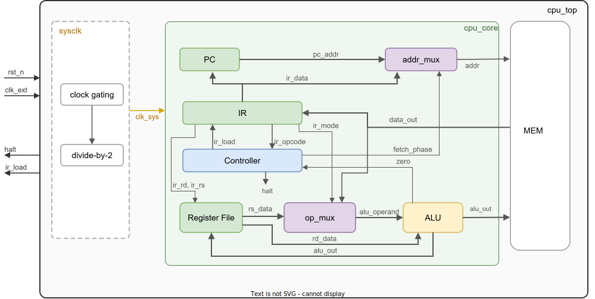
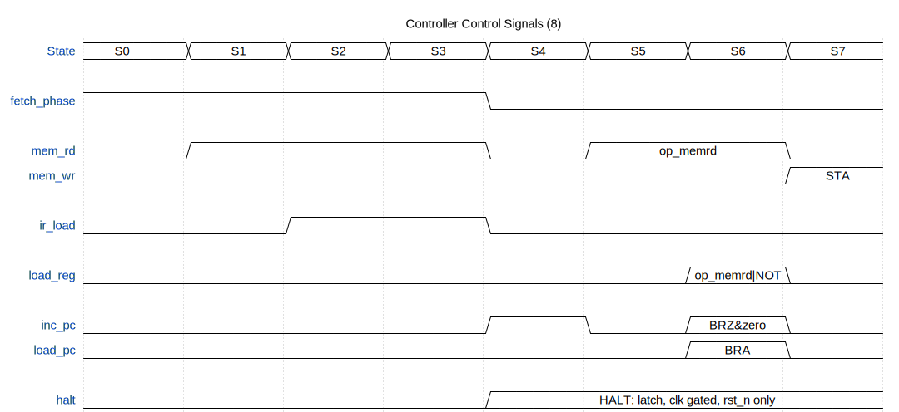

<!-- _class: title -->
<!-- _header: "" -->
<!-- _footer: "" -->
<!-- _paginate: false -->

# MicroCPU 설계 실무

Class 01: MicroCPU 스펙

<br><br><br><br><br><br>
건양대학교 국방반도체공학과<br>백종섭 교수

---

## 학습 목표

- MicroCPU의 전체 아키텍처와 설계 특징을 이해한다
- 16비트 명령어 구조와 mode 비트의 역할을 이해한다
- 8개 명령어(ISA)의 동작을 설명할 수 있다
- 외부 인터페이스(핀 스펙)를 이해한다
- 내부 블럭 구성과 데이터 경로를 파악한다
- 8-상태 FSM 기반 명령어 실행 흐름을 추적할 수 있다
- 각 블럭의 입출력 신호와 타이밍 관계를 분석할 수 있다

---

## 1.1 MicroCPU 아키텍처

> MicroCPU는 16비트 명령어와 16비트 데이터를 사용하는 16비트 프로세서이다

| 항목 | 스펙 | 설명 |
| --- | --- | --- |
| 워드 폭 | 16비트 | 메모리, 명령어, 레지스터, ALU 모두 16비트이다.<br>폰 노이만 구조이므로 명령어와 데이터가 같은 폭을 공유한다. |
| 명령어 구조 | 5필드, 16비트 | opcode(3b) + mode(1b) + rd(2b) + rs(2b) + data(8b).<br>하나의 명령어 안에 연산, 주소 지정 방식, 레지스터 2개, 메모리 주소를 모두 인코딩한다. |
| 메모리 구조 | 폰 노이만 | 명령어와 데이터가 동일한 256×16 메모리를 공유한다. |
| 레지스터 | 4×16비트 (R0~R3)<br>2R + 1W 포트 | Rd가 연산의 첫 번째 입력이자 결과 저장 대상이다.<br>4개의 값을 레지스터에 동시에 유지할 수 있다. |
| 명령어 세트 | 3비트 opcode, 8개 | 제어(HALT), 분기(BRZ, BRA), 데이터 이동(LDA, STA), 산술/논리(ADD, AND, NOT). |
| 주소 지정 | Direct, Register | `op_memrd`(ADD, AND, LDA)만 mode 비트로 Direct/Register를 전환한다.<br>나머지 명령어는 mode에 무관하다.<br>Immediate, Indirect, Indexed는 지원하지 않는다. |
| 클럭 | 단일 clk_sys | clk_ext를 2분주. halt 시 clock gating으로 정지. |
| 실행 구조 | 8 clk_sys/명령어<br>Fetch + Execute 2-phase | **Fetch**(S0~S3): 명령어를 읽어 IR에 저장하고 디코딩한다.<br>**Execute**(S4~S7): 피연산자 접근 + 연산 + 결과 저장. |

---

## 1.2 MicroCPU 명령어 구조

> 16비트 명령어 안에 mode 비트 하나를 두어, 메모리 모드와 레지스터 모드를 전환한다


| 필드 | 비트 | 이름 | 설명 |
| --- | --- | --- | --- |
| opcode | [15:13] | 연산 코드<br>(Operation Code) | 8개 명령어를 인코딩한다. |
| mode | [12] | 주소 지정 방식<br>(Addressing Mode) | op_mux의 sel 입력을 제어한다.<br>**mode=0 (메모리 모드)**: data[7:0]을 메모리 주소로 사용하여 mem[data]를 ALU에 전달한다.<br>**mode=1 (레지스터 모드)**: rs가 지정한 레지스터 값을 ALU에 전달한다. |
| rd | [11:10] | 목적 레지스터<br>(Destination Register) | R0(00), R1(01), R2(10), R3(11).<br>ALU 연산의 첫 번째 입력이자 결과 저장 대상이다. |
| rs | [9:8] | 소스 레지스터<br>(Source Register) | mode=1일 때 ALU의 두 번째 입력으로 사용된다.<br>mode=0일 때는 무시된다. |
| data | [7:0] | 주소<br>(Address) | 8비트 주소 필드. `op_memrd`의 Direct 모드에서 메모리 주소로 사용된다.<br>Register 모드에서는 사용되지 않는다. |

---

## 1.3 MicroCPU 명령어 세트 (ISA: Instruction Set Architecture)

> 3비트 opcode로 8개 명령어를 정의하며, mode 비트에 따라 피연산자 소스가 달라진다

| 그룹 | Opcode | 이름 | 인코딩 | Direct 모드 | Register 모드 | Note |
| --- | --- | --- | --- | --- | --- | --- |
| **제어** | HALT | Halt | 000 | 프로세서 정지 | <span class="rtl">프로세서 정지</span> | clock gating으로 전체 정지. rst_n으로만 해제 |
| **분기** | BRZ | Branch if Zero | 001 | Rd=0이면 PC += 1 | <span class="rtl">Rd=0이면 PC += 1</span> | 유일한 조건 분기. Rd가 0이면 다음 명령어를 건너뛴다 |
| | BRA | Branch Always | 010 | PC = data | <span class="rtl">PC = data</span> | 무조건 분기. data[7:0]을 PC에 로드 |
| **데이터 이동** | LDA | Load | 011 | Rd = mem[data] | Rd = Rs | Register 모드에서는 레지스터 간 복사 |
| | STA | Store | 100 | mem[data] = Rd | <span class="rtl">mem[data] = Rd</span> | Rd 값을 메모리에 저장 |
| **산술/논리** | ADD | Add | 101 | Rd = Rd + mem[data] | Rd = Rd + Rs | 2's complement 덧셈 |
| | AND | And | 110 | Rd = Rd & mem[data] | Rd = Rd & Rs | 비트 단위 논리곱 |
| | NOT | Not | 111 | Rd = ~Rd | <span class="rtl">Rd = ~Rd</span> | 단항 연산. 메모리 읽기 불필요 |

- `op_memrd` (ADD, AND, LDA): mode 구분이 있다. Direct/Register에 따라 피연산자 소스가 달라진다
- `!op_memrd` (HALT, BRZ, BRA, STA, NOT): mode에 무관하다

---

## 1.4 MicroCPU 핀 스펙

> cpu_top 모듈은 4개 핀만 외부에 노출하며, 내부의 모든 클럭과 데이터 경로는 외부에서 보이지 않는다

| Pin Name | Type | Width | Description |
| --- | --- | --- | --- |
| clk_ext | Input | 1 | System clock. Rising edge active.<br>sysclk에서 2분주되어 내부 클럭(clk_sys)을 생성한다. |
| rst_n | Input | 1 | Active-low asynchronous reset.<br>Low 입력 시 클럭과 무관하게 모든 내부 레지스터를 0으로 클리어하고, FSM을 초기 상태로 복귀시킨다. |
| halt | Output | 1 | Processor halt indicator. Active-high.<br>HALT 명령어(opcode 000) 실행 시 high가 되며, 리셋 전까지 유지된다.<br>halt=1이면 clock gating으로 내부 클럭이 정지한다. |
| ir_load | Output | 1 | Instruction fetch observation signal. Active-high.<br>매 fetch 단계에서 1사이클 동안 high가 된다. 실행된 명령어 수를 측정하거나 명령어 경계를 식별하는 데 사용한다. |

---

## 1.5 MicroCPU 블럭 다이어그램



---

## 1.6 MicroCPU 내부 신호

<style scoped>
td, th { padding-left: 6px; padding-right: 6px; }
</style>

> 블럭 다이어그램의 각 신호가 어디서 출발하여 어디로 도착하는지를 정리한다

| Signal | Width | From | To | Description |
| --- | --- | --- | --- | --- |
| pc_addr | 8 | PC | addr_mux | 현재 명령어의 메모리 주소를 전달한다. |
| ir_data | 8 | IR | addr_mux, PC | 피연산자 주소 또는 분기 주소를 전달한다. |
| addr | 8 | addr_mux | MEM | fetch/operand phase에 따라 선택된 메모리 주소를 전달한다. |
| data_out | 16 | MEM | IR, op_mux | 메모리에서 읽은 명령어 또는 피연산자 데이터를 전달한다. |
| ir_opcode | 3 | IR | Controller | 디코딩된 opcode를 Controller에 전달한다. |
| ir_mode | 1 | IR | op_mux | mode 비트로 Operand MUX의 입력을 선택한다. |
| ir_rd, ir_rs | 2, 2 | IR | Register File | 목적/소스 레지스터 주소를 전달한다. |
| rd_data | 16 | Register File | ALU | Rd 레지스터 값을 ALU의 첫 번째 입력(accum)으로 전달한다. |
| rs_data | 16 | Register File | op_mux | Rs 레지스터 값을 Operand MUX에 전달한다(mode=1). |
| alu_operand | 16 | op_mux | ALU | 선택된 피연산자를 ALU의 두 번째 입력(din)으로 전달한다. |
| alu_out | 16 | ALU | Register File, MEM | 연산 결과를 Rd에 저장하거나, STA 시 메모리에 기록한다. |
| zero | 1 | ALU | Controller | Rd가 0이면 high. BRZ 분기 판단에 사용한다. |

---

## 1.7 MicroCPU 명령어 실행 — 데이터 흐름

<style scoped>
table { width: 100%; }
td, th { padding: 6px 12px; }
td:nth-child(6) { width: 55%; }
</style>

> 하나의 명령어는 8개 FSM 상태를 순차적으로 거쳐 실행된다. 8 clk_sys = 1 명령어 주기

| FSM | 이름 | fetch | From | To | 설명 | 신호 |
| :---: | :---: | :---: | :---: | :---: | --- | :---: |
| S0 | <span class="ltr">INST_ADDR</span> | 1 | PC | addr_mux | PC 주소를 addr_mux에 전달한다 | |
| S1 | <span class="ltr">INST_FETCH</span> | 1 | addr_mux | MEM | PC 주소로 MEM 읽기 시작 | mem_rd(1) |
| S2 | <span class="ltr">INST_LOAD</span> | 1 | MEM | IR | 16비트 명령어를 IR에 래치 | mem_rd(1)<br>ir_load(1) |
| S3 | <span class="ltr">IDLE</span> | 1 | IR | — | 명령어를 5개 필드로 디코딩 | mem_rd(1)<br>ir_load(1) |
| S4 | <span class="rtl">OP_ADDR</span> | 0 | IR | addr_mux | fetch_phase=0으로 전환. addr_mux가 ir_data[7:0]을 선택한다 | inc_pc(1)<br>halt(HALT) |
| S5 | <span class="rtl">OP_FETCH</span> | 0 | addr_mux | MEM | op_memrd이면 data[7:0] 주소의 MEM을 읽는다. 그 외이면 읽지 않는다 | mem_rd(op_memrd) |
| S6 | <span class="rtl">OP_ALU</span> | 0 | regfile<br>op_mux | ALU | op_memrd: mode에 따라 연산 수행. NOT: ~Rd. 결과가 ALU에 즉시 출력된다(조합). HALT/BRZ/BRA/STA: Controller가 직접 제어한다 | mem_rd(op_memrd)<br>load_reg(op_memrd\|NOT)<br>load_pc(BRA)<br>inc_pc(BRZ&zero) |
| S7 | <span class="rtl">UPDATE</span> | 0 | ALU<br>regfile | regfile<br>MEM | op_memrd: ALU 결과를 regfile에 저장. STA: regfile의 Rd 값을 MEM에 기록. HALT/BRZ/BRA: 갱신 없음 | load_reg(op_memrd)<br>mem_wr(STA) |

---

## 1.8 MicroCPU 명령어 실행 — 제어 신호

> Fetch phase의 제어 신호는 모든 명령어에서 동일하고, Execute phase의 제어 신호는 opcode에 따라 조건부로 활성화된다



---

## 1.9 MicroCPU 구성 블럭

| 블럭 | 모듈 | 인스턴스 | 클럭 | 설명 |
| --- | --- | --- | :---: | --- |
| **cpu_top** | | | | |
| sysclk | sysclk | u_sysclk | clk_ext | clock gating + 2분주. halt=1이면 clk_sys 정지 |
| MEM | mem | u_mem | clk_sys | 256x16 동기 메모리. 명령어와 데이터를 동일 공간에 저장한다 |
| **cpu_core** | | u_cpu_core | | |
| Controller | control | u_ctrl | clk_sys | 8-상태 Mealy FSM. 8개 제어 신호 + fetch_phase를 출력한다 |
| PC | prog_counter | u_pc | clk_sys | 8-bit Program Counter. 매 명령어마다 자동 증가한다 |
| IR | instr_reg | u_ir | clk_sys | 16-bit Instruction Register. 명령어를 5개 필드로 분리한다 |
| Register File | regfile | u_regfile | clk_sys | 4x16-bit 레지스터 파일(R0-R3). 2R+1W 포트 |
| ALU | alu | u_alu | (조합) | 16-bit 산술/논리 연산기. zero 플래그를 출력한다 |
| addr_mux | mux2to1 #(8) | u_addrmux | (조합) | fetch_phase에 따라 PC 주소와 IR data 중 하나를 선택한다 |
| op_mux | mux2to1 #(16) | u_opmux | (조합) | mode에 따라 MEM data 또는 Rs를 선택한다 |

---

## 1.10 cpu_pkg 패키지

> 전체 블럭이 공유하는 타입 정의. opcode와 FSM 상태를 enum으로 선언하여 가독성과 안전성을 확보한다

<div class="columns">
<div>

- 패키지로 타입을 공유하여 모듈 간 일관성을 보장한다
- enum은 숫자 대신 이름으로 코딩하여 가독성과 안전성을 높인다
- `import cpu_pkg::*;`로 모든 모듈에서 사용
- opcode_t: 3비트
  - 8개 명령어를 기능별 그룹으로 인코딩
- state_t: 3비트
  - 8개 FSM 상태를 Fetch/Execute 2-phase로 구분

</div>
<div>

```verilog
package cpu_pkg;

  typedef enum logic [2:0] {
     HALT,           // Control
     BRZ, BRA,       // Branch
     LDA, STA,       // Data Move
     ADD, AND, NOT   // ALU
  } opcode_t;

  typedef enum logic [2:0] {
     INST_ADDR,    // S0 Fetch
     INST_FETCH,   // S1
     INST_LOAD,    // S2
     IDLE,         // S3
     OP_ADDR,      // S4 Execute
     OP_FETCH,     // S5
     OP_ALU,       // S6
     UPDATE        // S7
  } state_t;

endpackage : cpu_pkg
```

</div>
</div>

---

## 1.11 sysclk 블럭

<style scoped>
table { width: 100%; }
td:nth-child(5) { width: 65%; }
</style>

> clock gating + 2분주. halt=1이면 clk_sys가 정지하며, rst_n으로만 해제된다

| Port | Dir | Width | From | Description |
| --- | :---: | :---: | --- | --- |
| clk_ext | in | 1 | 외부 핀 | 시스템 클럭. rising edge active |
| rst_n | in | 1 | 외부 핀 | 비동기 리셋. low이면 div를 0으로 초기화 |
| halt | in | 1 | Controller | halt. 1이면 clk_i=0으로 고정되어 clk_sys가 정지한다 |
| clk_sys | out | 1 | | clk_ext를 2분주한 내부 클럭. 모든 순차 블럭의 동작 기준 |

```verilog
wire clk_i = clk_ext & ~halt;

always_ff @(posedge clk_i or negedge rst_n)
   if (!rst_n)  div <= 1'b0;
   else         div <= ~div;

assign clk_sys = div;
```

---

## 1.12 mem 블럭

> 256x16 동기 메모리. read와 write는 동시에 high가 되지 않는다

<div class="columns">
<div>

| Port | Dir | Width | From | Description |
| --- | :---: | :---: | --- | --- |
| clk | in | 1 | sysclk | 시스템 클럭 |
| read | in | 1 | Controller | mem_rd |
| write | in | 1 | Controller | mem_wr |
| addr | in | 8 | addr_mux | 메모리 주소 |
| data_in | in | 16 | ALU | 쓰기 데이터 |
| data_out | out | 16 | | 읽기 데이터 |

</div>
<div>

```verilog
logic [15:0] memory [0:255];

// Write
always @(posedge clk)
   if (write && !read)
      memory[addr] <= data_in;

// Read
always_ff @(posedge clk)
   if (read && !write)
      data_out <= memory[addr];
```

</div>
</div>

---

## 1.13 Controller 모듈 동작

> 8-상태 FSM이 opcode와 zero를 입력받아 8개 제어 신호를 생성한다. opcode를 디코딩하여 op_memrd, is_halt, is_brz, is_bra, is_sta 조건을 만들고, FSM 상태와 조합하여 각 제어 신호의 활성 타이밍을 결정한다. 1.8의 상태별 제어 신호 다이어그램으로 구현 가능하다

<div class="columns">
<div>

| Port | Dir | Width | From | Description |
| --- | :---: | :---: | --- | --- |
| clk | in | 1 | sysclk | 시스템 클럭 |
| rst_n | in | 1 | 외부 핀 | 비동기 active-low 리셋 |
| ir_opcode | in | 3 | IR | 명령어의 opcode |
| zero | in | 1 | ALU | ALU zero 플래그 |
| fetch_phase | out | 1 | | Fetch/Execute phase 표시 |
| mem_rd | out | 1 | | MEM 읽기 enable |
| mem_wr | out | 1 | | MEM 쓰기 enable |
| ir_load | out | 1 | | IR 래치 enable |
| load_reg | out | 1 | | regfile 쓰기 enable |
| inc_pc | out | 1 | | PC 증가 enable |
| load_pc | out | 1 | | PC 분기 주소 로드 enable |
| halt | out | 1 | | HALT 시 1로 래치 |

</div>
<div>

```verilog
// opcode decode
assign op_memrd = (ir_opcode inside {ADD, AND, LDA});
wire is_not = (ir_opcode == NOT);
wire is_halt = (ir_opcode == HALT);
wire is_brz  = (ir_opcode == BRZ);
wire is_bra  = (ir_opcode == BRA);
wire is_sta  = (ir_opcode == STA);

// halt latch
always_ff @(posedge clk or negedge rst_n)
   if (!rst_n) halt <= 0;
   else if (state == OP_ADDR && is_halt)
      halt <= 1;

// FSM — halt시 정지
always_ff @(posedge clk or negedge rst_n)
   if (!rst_n)          state <= INST_ADDR;
   else if (!halt)  state <= state.next();
```

</div>
</div>

---

## 1.14 IR 모듈 동작

> 16-bit Instruction Register. 메모리에서 읽은 명령어를 래치하고 5개 필드로 디코딩한다

<div class="columns">
<div>

| Port | Dir | Width | From | Description |
| --- | :---: | :---: | --- | --- |
| clk | in | 1 | sysclk | 시스템 클럭 |
| rst_n | in | 1 | 외부 핀 | 비동기 리셋 |
| enable | in | 1 | Controller | ir_load |
| din | in | 16 | MEM | 래치할 데이터 |
| ir_opcode | out | 3 | | [15:13] 연산 코드 |
| ir_mode | out | 1 | | [12] 주소 지정 방식 |
| ir_rd | out | 2 | | [11:10] 목적 레지스터 |
| ir_rs | out | 2 | | [9:8] 소스 레지스터 |
| ir_data | out | 8 | | [7:0] 주소 |

</div>
<div>

```verilog
logic [15:0] ir_out;

always_ff @(posedge clk, negedge rst_n)
   if (!rst_n)      ir_out <= '0;
   else if (enable)  ir_out <= din;

// Field decode
assign ir_opcode = opcode_t'(ir_out[15:13]);
assign ir_mode = ir_out[12];
assign ir_rd   = ir_out[11:10];
assign ir_rs   = ir_out[9:8];
assign ir_data = ir_out[7:0];
```

</div>
</div>

---

## 1.15 Register File 모듈 동작

> 4x16-bit 레지스터 파일(R0~R3). 읽기는 조합, 쓰기는 동기

<div class="columns">
<div>

| Port | Dir | Width | From | Description |
| --- | :---: | :---: | --- | --- |
| clk | in | 1 | sysclk | 시스템 클럭 |
| rst_n | in | 1 | 외부 핀 | 비동기 리셋 |
| rd_addr | in | 2 | IR | Rd 읽기 주소 |
| rs_addr | in | 2 | IR | Rs 읽기 주소 |
| wr_data | in | 16 | ALU | 쓰기 데이터 |
| wr_addr | in | 2 | IR | 쓰기 주소 |
| wr_en | in | 1 | Controller | load_reg |
| rd_data | out | 16 | | regs[rd_addr] 조합 출력 |
| rs_data | out | 16 | | regs[rs_addr] 조합 출력 |

</div>
<div>

```verilog
logic [15:0] regs [0:3];

// Synchronous write
always_ff @(posedge clk, negedge rst_n)
   if (!rst_n) begin
      regs[0] <= '0;
      regs[1] <= '0;
      regs[2] <= '0;
      regs[3] <= '0;
   end
   else if (wr_en)
      regs[wr_addr] <= wr_data;

// Combinational read
assign rd_data = regs[rd_addr];
assign rs_data = regs[rs_addr];
```

</div>
</div>

---

## 1.16 op_mux 모듈 동작

> 파라미터화된 2:1 MUX. sel_a에 따라 두 입력 중 하나를 선택하여 출력한다. 조합 로직

<div class="columns">
<div>

| Port | Dir | Width | From | Description |
| --- | :---: | :---: | --- | --- |
| din_a | in | 16 | MEM | 첫 번째 입력 |
| din_b | in | 16 | regfile | 두 번째 입력 |
| sel_a | in | 1 | IR | 1이면 din_a, 0이면 din_b 선택 |
| dout | out | 16 | | 선택된 출력 |

</div>
<div>

```verilog
// mux2to1 #(16)
assign dout = sel_a ? din_a : din_b;
```

</div>
</div>

---

## 1.17 PC 모듈 동작

> 8-bit 카운터. load 시 din 값을 로드하고, enable 시 +1 증가한다. load가 enable보다 우선한다

<div class="columns">
<div>

| Port | Dir | Width | From | Description |
| --- | :---: | :---: | --- | --- |
| clk | in | 1 | sysclk | 시스템 클럭 |
| rst_n | in | 1 | 외부 핀 | 비동기 리셋 |
| load | in | 1 | Controller | load_pc. 1이면 pc_count = din. load와 enable이 동시에 1이면 load가 우선한다 |
| enable | in | 1 | Controller | inc_pc. 1이면 pc_count += 1. load=0일 때만 동작한다 |
| din | in | 8 | IR | load 시 로드할 값 |
| pc_count | out | 8 | | 현재 카운터 값. rst_n이면 0x00 |

</div>
<div>

```verilog
always_ff @(posedge clk, negedge rst_n)
   if (!rst_n)       pc_count <= '0;
   else if (load)    pc_count <= din;
   else if (enable)  pc_count <= pc_count + 1;
```

</div>
</div>

---

## 1.18 addr_mux 모듈 동작

> 파라미터화된 2:1 MUX. sel_a에 따라 두 입력 중 하나를 선택하여 출력한다. 조합 로직

<div class="columns">
<div>

| Port | Dir | Width | From | Description |
| --- | :---: | :---: | --- | --- |
| din_a | in | 8 | PC | 첫 번째 입력. sel_a=1이면 선택 |
| din_b | in | 8 | IR | 두 번째 입력. sel_a=0이면 선택 |
| sel_a | in | 1 | Controller | 1이면 din_a, 0이면 din_b 선택 |
| dout | out | 8 | | 선택된 출력 |

</div>
<div>

```verilog
// mux2to1 #(8)
assign dout = sel_a ? din_a : din_b;
```

</div>
</div>

---

## 1.19 ALU 모듈 동작

> 16-bit 조합 논리 연산기. 입력이 바뀌면 즉시 출력이 바뀐다

<div class="columns">
<div>

| Port | Dir | Width | From | Description |
| --- | :---: | :---: | --- | --- |
| accum | in | 16 | regfile | 첫 번째 피연산자 |
| din | in | 16 | op_mux | 두 번째 피연산자 |
| opcode | in | 3 | IR | 연산 종류 선택 |
| dout | out | 16 | | 연산 결과 |
| zero | out | 1 | | ~(\|accum) |

</div>
<div>

```verilog
always_comb
   unique case (opcode)
      ADD : dout = accum + din;
      AND : dout = accum & din;
      NOT : dout = ~accum;
      LDA : dout = din;
      default : dout = accum;
   endcase

assign zero = ~(|accum);
```

</div>
</div>

---

## 복습

- 1.1: 16비트 프로세서. 폰 노이만, 4개 범용 레지스터, 단일 clk_sys
- 1.2: 16비트 명령어 = opcode(3) + mode(1) + rd(2) + rs(2) + data(8)
- 1.3: 8개 명령어. `op_memrd`(ADD, AND, LDA)만 mode 전환, 나머지는 mode 무관
- 1.4: cpu_top은 4핀(clk_ext, rst_n, halt, ir_load)만 외부에 노출
- 1.7: 8-상태 FSM(S0~S7), Fetch + Execute 2-phase, 8 clk_sys = 1 명령어
- 1.8: Controller가 8개 제어 신호를 생성. `op_memrd`와 `is_not`으로 분류
- 1.10: cpu_pkg — opcode_t(8개), state_t(8상태) enum 정의
- 1.11~1.19: 각 블럭이 단일 clk_sys에서 동작. halt 시 clock gating으로 전체 정지

---

## Thank You

🔖 1.1 MicroCPU 아키텍처
🔖 1.2 MicroCPU 명령어 구조
🔖 1.3 MicroCPU 명령어 세트 (ISA)
🔖 1.4 MicroCPU 핀 스펙
🔖 1.5 MicroCPU 블럭 다이어그램
🔖 1.6 MicroCPU 내부 신호
🔖 1.7 MicroCPU 명령어 실행 — 데이터 흐름
🔖 1.8 MicroCPU 명령어 실행 — 제어 신호
🔖 1.9 MicroCPU 구성 블럭
🔖 1.10 cpu_pkg 패키지
🔖 1.11 sysclk 블럭
🔖 1.12 mem 블럭
🔖 1.13 Controller 모듈 동작
🔖 1.14 IR 모듈 동작
🔖 1.15 Register File 모듈 동작
🔖 1.16 op_mux 모듈 동작
🔖 1.17 PC 모듈 동작
🔖 1.18 addr_mux 모듈 동작
🔖 1.19 ALU 모듈 동작
